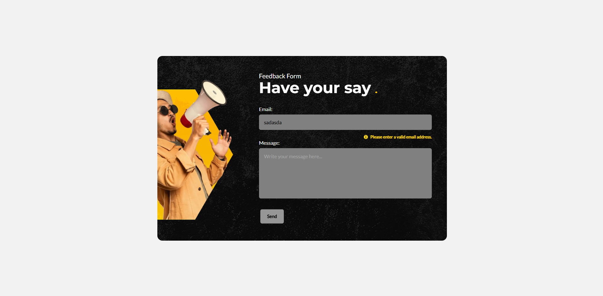

;

# Feedback Form Project

A fully accessible, dynamic feedback form built using HTML, CSS, vanilla JavaScript, and PHP—with optional integration as a WordPress plugin.

---

## ✅ Modules Completed

- **Module 1: HTML & CSS**  
  Built a fully responsive and accessible feedback form using semantic HTML, SASS and optimized assets using Vite.

- **Module 2: JavaScript**  
  Implemented form validation, interactive UI feedback, and AJAX-based form submission using vanilla JavaScript.

- **Module 3: PHP**  
  Developed a lightweight back-end script (`submit.php`) that handles validation, stores form submissions to a JSON file, and prevents duplicate entries.

- **Module 4: WordPress**  
  Refactored the form and back-end logic into a WordPress plugin for easy reuse, utilizing `admin-ajax.php` and nonces for secure submissions - switching from saving to a JSON file to utilising a custom WP database table.

---

## 🛠 Installation & Testing

### Prerequisites

- Node.js & npm
- PHP or LAMP Server (for backend testing)
- WordPress environment for plugin testing. I use [LocalWP](https://localwp.com/)


### Vanilla/PHP App

This version runs as a standalone HTML/CSS/JS form with a PHP backend.

1. **Navigate to the project directory and install dependencies**
   ```bash
   cd feedback-form-pie
   npm install
   ```

2. **Build the project**
```bash
npm run build
```


3. **Start the PHP server**
```bash
npm run serve:php
```
Then visit: [http://localhost:8000](http://localhost:8000);


4. **Testing**

- Fill out the form correctly 
- Submit
- Verify feedback.json contains the submitted entry


### WordPress Plugin

This version is wrapped in a custom plugin for integration with WordPress.


1. **Build the plugin assets**
```bash
npm run build:wordpress
```


2. **Copy the plugin folder**

Manually copy the feedback-plugin folder (inside your project) to your local WordPress installation's plugin directory:

```bash
wp-content/plugins/
```

3. **Activate Plugin**

Log in to your WordPress admin dashboard and activate the "Feedback Plugin" from the Plugins section.


4. **Usage: Add to page/post as shortcode or block**

Use the shortcode [feedback_form] in any post or page to display the form.

Alternatively, if ACF Pro is installed and activated on your theme, you may select the feedback_form block via the gutenberg editor, instead.


**⚠️ Note: This plugin supports traditional themes, and is not currently configured for full-site editing. To ensure compatibility, I suggest activating a theme such as TwentyTwentyThree for testing purposes.**

---

## 🧠 Obstacles & Solutions

- **PHP not recognized in VS Code:**  
  Resolved by installing PHP globally and updating the system PATH variable. 
  
- **Fonts not loading via Apache:**  
  Fixed by adjusting relative paths in SASS and using `base` configuration in Vite to avoid `/`-rooted asset URLs.

- **AJAX returning unexpected `<html>`:**  
  The issue was due to a misconfigured path or incorrect response type—solved by ensuring headers were set correctly, and the correct endpoint was hit and returned valid JSON.

- **Differences in structure of response object between environments**  
  Both the Vanilla App and WordPress Plugin both referenced the same JavaScript file when making AJAX requests to the server. However WordPress was implemented with the security of nonces, and as such the response object was structured to include this. Initially I did not take this into account and the Vanilla App returned an error due to the undefined property. 


---

## 🔧 With More Time I Would...

- Refactor the successDialog into a reusable modal as it handles more than just the success state.
- Expand ACF Block to support customisatisation, including additional input fields as well as the editing of text content and colour/image assets.
- Add form animation and transition states to improve UX.
- Implement unit and integration testing for JS and PHP logic (Vitest, PHPUnit)
- Restrict access to specific user roles for Feedback page in WordPress dashboard
- Improve layout for admin-page and add CRUD functionality.
- Setup a docker container to make it easier to share the project.
---


### Known issues
- Logic wrote to manage seperate timers for each 'typing indicator' has introduced a bug where if the user switches focus from one field to the other before validation has completed, and then enters valid input into the new field, the error for the original field will not display. I suspect this is due to the way I manage timers and targets within handleInput.

- Unused styles. My initial setup included using Utopia for a fluid type/spacing system so I could ensure consistency when developing. It soon became clear this was overengineered for a single form component, and as such a few of the variables have not been used and will need to be removed from the stylesheet in the future (unless developed upon as part of a larger application/pattern library.)


## 📣 Final Notes

This project took longer than anticipated. Major reasons being the attempt of a new workflow/build process (dual environments) and the unfamiliarity with path resolution and asset management within this setup. What initially seemed like a small adjustment to my existing workflow ended up adding hours onto the development time. This task has taught me the importance of managing project scope and experimenting beforehand.

Overall I'm happy with how the task turned out.


